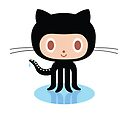

# CIT 281 Project 1

## Learning Objectives

<a> https://pages.uoregon.edu/meaghand/281/ </a>

- Basic Unix Shell commands
- Install and Configure Git using the Unix Shell
- While doing this project I have learned multiple git commands like git status, add ., and commit -m "..."
- Github overview
